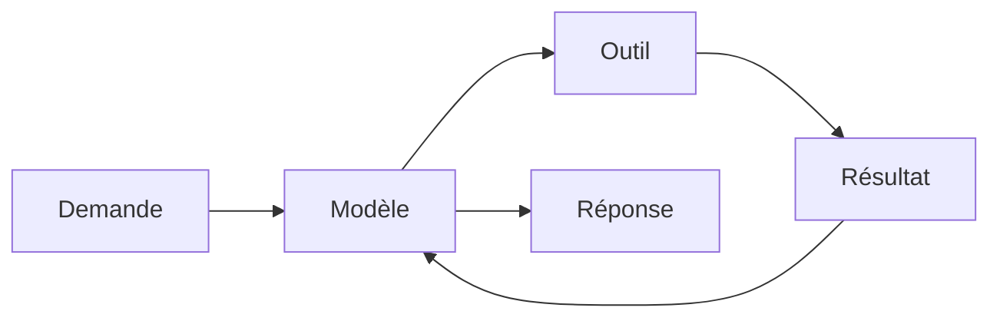

# La boucle agentique

Deux formes : le Mermaid ci-dessous pour la lecture dans Obsidian, et `boucle.svg`, dessiné à la main aux couleurs du thème, pour les slides et le tableau. Si la figure change, modifier les deux ; le SVG fait foi pour la projection.

![[boucle.svg]]

Dessinée au tableau au Module 0, reste visible toute la journée. Chaque module y accroche son mécanisme.

Accroches prévues : CLAUDE.md et skills entrent dans **Modèle** (ce qu'il sait) ; MCP ajoute des **Outils** ; les hooks se posent sur les flèches **Modèle → Outil** et **Outil → Résultat** ; un sous-agent est une boucle entière dans la case Outil.
