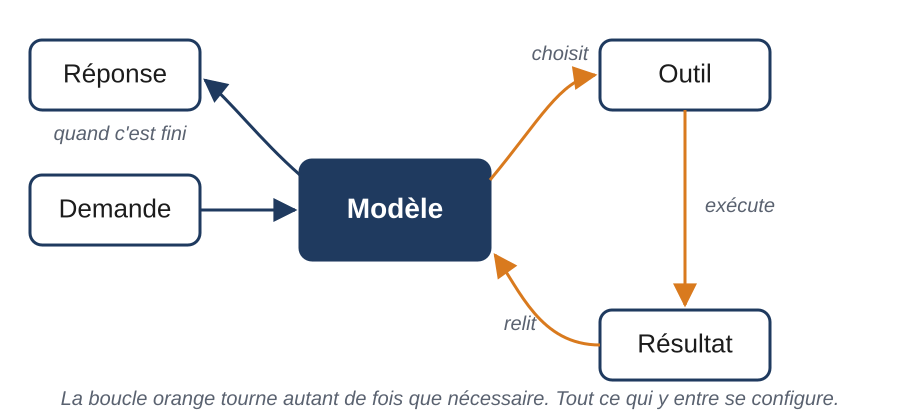
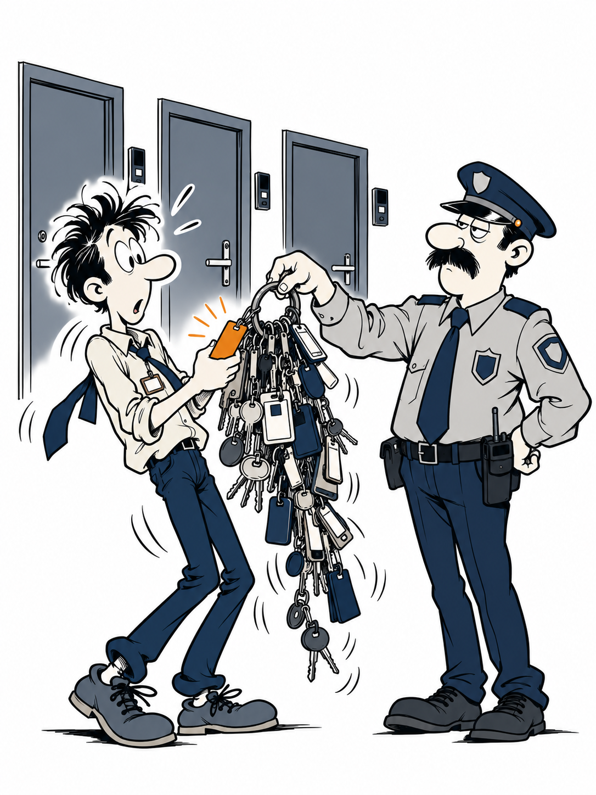

<!--
Une section « ## M.n — Titre » par slide, séparée par ---. La slide 0.3 (Le nouveau collègue)
est réaffichée en ouverture de chaque module avec la ligne du jour surlignée.
Rendu : voir supports/README.md.
-->

<!-- _class: lead -->
<!-- _paginate: false -->


# Étendre Claude Code

Six mécanismes, une demi-journée, deux équipes.

---

## 0.1 — Ce n'est pas un chat



> Tout ce qui entre dans cette boucle se configure.

---

## 0.2 — Trois questions

Étendre Claude Code, c'est répondre à trois questions.

1. Qu'est-ce qu'il **sait** ?
2. À quoi est-il **connecté** ?
3. Que se passe-t-il **automatiquement** ?

Pas de nom de mécanisme sur cette slide.

---

## 0.3 — Le nouveau collègue


<style scoped>table{font-size:.62em}</style>

| Le collègue | Le mécanisme | Module |
|---|---|---|
| La fiche de poste qu'on lui donne le premier jour | CLAUDE.md | 1 |
| Les procédures qu'il consulte quand il en a besoin | Skills | 2 |
| Le stagiaire à qui il délègue une recherche | Sous-agents | 3 |
| Ses accès : CRM, base de données, Slack | MCP | 4 |
| Les règles du bâtiment : badge, alarme incendie | Hooks | 5 |
| Le kit d'onboarding qu'on copie pour la prochaine équipe | Plugins | 6 |

---

## 1.1 — Ce qu'il sait sans qu'on le lui dise


**CLAUDE.md** : un fichier markdown, lu en entier au début de chaque session.

- Le seul mécanisme *toujours* actif.
- Donc : tout ce qu'on y met coûte à chaque conversation.
- Une consigne, pas une barrière.

---

## 1.2 — Trois niveaux qui s'additionnent

| Niveau | Fichier | Qui le voit |
|---|---|---|
| Moi, partout | `~/.claude/CLAUDE.md` | Moi seul |
| Le projet | `CLAUDE.md` à la racine | Toute l'équipe |
| Moi, sur ce projet | `CLAUDE.local.md` | Moi seul |

Rien n'écrase rien. Moins de 200 lignes par fichier. Le reste va dans un skill ou dans `.claude/rules/`.

---

## 1.3 — Exercice : dix lignes

Dix lignes de CLAUDE.md pour **votre** contexte, à partir du squelette.

1. Remplir (4 min). Le binôme relit : « celle-là, tu la vérifies comment ? »
2. Lancer une session, tester une ligne (3 min). `/context` si rien ne se passe.
3. Garder une ligne qui a marché, une qui n'a pas marché.

---

## 1.4 — Souhait ou contrainte ?


---

## 1.5 — Souhait ou contrainte ?

| Souhait | Contrainte |
|---|---|
| « Essaie de garder les réponses courtes » | « 150 mots maximum » |
| « Fais attention aux migrations » | « Ne jamais modifier `migrations/` sans demander » |
| « Sois poli avec les clients » | « Vouvoiement. Clôture : "Nous restons à votre disposition." » |

Une contrainte se vérifie. **Signal** : Claude se trompe deux fois sur la même convention.

---

## 2.1 — Un dossier, un fichier


```
.claude/skills/reponse-ticket/
└── SKILL.md
```

```markdown
---
name: reponse-ticket
description: Rédige la réponse à un ticket support…
---
Le corps : ce qu'il doit faire, en français.
```

---

## 2.2 — Deux natures, un format

| Référence | Action |
|---|---|
| Un savoir appliqué toute la session | Une procédure qu'on lance |
| `produits-et-tarifs`, guide de style API | `/reponse-ticket`, `/review` |
| Chargé quand le sujet arrive | `/nom`, ou déclenché par Claude |

Effets de bord (envoyer, publier, déployer) : `disable-model-invocation: true`.

---

## 2.3 — Ce qui est lu, et quand


- Au démarrage : **la description**, de tous les skills.
- Au déclenchement : le corps, qui reste ensuite dans la conversation.
- Jamais, sauf lien suivi : les fichiers à côté.

**La description décide.** Un skill inutilisé coûte une ligne.

---

## 2.4 — Construire `/reponse-ticket`

Le formateur à l'écran, vous sur votre poste. Étapes dans le TP 2.

1. Le dossier et le fichier, à partir du squelette (3 min).
2. Le corps : classer, lire la fiche client, rédiger, joindre un article (2 min).
3. Ticket T-0417 (3 min). Ticket T-0402 (3 min). Que s'est-il passé ?
4. Corriger la description, relancer (2 min). Ticket T-0431 (2 min).

---

## 2.5 — La description décide

| v1 | v2 |
|---|---|
| Rédige la réponse à un ticket support. | Rédige la réponse à un ticket support. À utiliser dès qu'on demande de répondre à un client, une réclamation, un mail ou un message reçu au support, même sans le mot « ticket ». Pas pour les relances commerciales. |

Trois parties : **ce qu'il fait**, **quand**, avec les mots des gens, **ce qu'il ne fait pas**.

---

## 2.6 — Signal

> Tu retapes le même prompt, ou tu colles la même procédure, pour la **troisième fois**.

Un skill est une procédure *disponible*, pas *imposée*. Pour imposer : Module 5.

---

## 3.1 — Un stagiaire, une mission, un résumé


Un sous-agent a :

- son **contexte**, vide au départ ;
- sa **consigne**, dans `.claude/agents/<nom>.md` ;
- ses **outils**, parfois moins que la conversation.

Il ne rapporte qu'un **résumé**. Le reste disparaît.

---

## 3.2 — Ce qu'il voit, ce qu'il ne voit pas

| Il voit | Il ne voit pas |
|---|---|
| Sa consigne | La conversation en cours |
| La mission que Claude lui confie | Ce que vous avez dit avant |
| Le CLAUDE.md du projet | Les skills, sauf préchargés |

La mission se formule **en entier**, comme à quelqu'un qui arrive.

---

## 3.3 — Trois usages

1. **Isoler** : une tâche bavarde dont seule la conclusion compte.
2. **Paralléliser** : trois recherches, trois sous-agents, trois résumés.
3. **Restreindre** : lecture seule, modèle plus léger, skill préchargé.

Au-delà de quelques sous-agents : un *workflow*, script qui en orchestre des dizaines.

Ce n'est pas fait pour itérer : pas de mémoire de l'échange.

---

## 3.4 — La tâche qui inonde

Sur votre fiche, une ligne :

> Quelle tâche de ma semaine produit des pages que je ne relis jamais ?
> Qu'est-ce que je voudrais en retenir, en cinq lignes ?

Deux minutes seul. Puis une phrase chacun.

**Signal** : une tâche annexe produit des pages de sortie que tu ne reliras jamais.

---

## 4.1 — Un protocole, des serveurs, des outils



Un **serveur MCP** expose un système externe sous forme d'**outils** : lire une fiche, lancer une requête, créer une issue.

- L'authentification est **du côté du serveur**. Claude ne voit jamais le mot de passe.
- Trois familles : serveurs distants des éditeurs, serveurs locaux sur le poste, connecteurs claude.ai (Drive, Gmail, Slack).

---

## 4.2 — L'accès et le savoir-faire

| MCP donne | Le skill donne |
|---|---|
| L'accès au CRM | La procédure de réponse |
| La requête sur la base | Ce qu'il faut vérifier, dans quel ordre |
| L'écriture dans le ticketing | Ce qu'on n'écrit jamais |

Un MCP sans skill : il a accès et ne sait pas quoi chercher.
Un skill sans MCP : il sait quoi chercher et ne peut pas.

---

## 4.3 — Où ça se configure

| Portée | Où | Qui |
|---|---|---|
| Locale | Mon poste, ce projet | Moi seul |
| Projet | `.mcp.json` à la racine, partagé | L'équipe, chacun approuve une fois |
| Utilisateur | Mon poste, tous mes projets | Moi seul |

Locale > projet > utilisateur. `/mcp` : état, outils, authentification.

---

## 4.4 — Trois précautions

1. **Un serveur, c'est quelqu'un qu'on laisse entrer.** Seulement ceux qu'on connaît.
2. **Lecture seule** quand c'est possible. Un accès en écriture, c'est un hook qui le garde.
3. **Un serveur inutilisé coûte.** On débranche ce qu'on n'utilise pas.

**Signal** : tu copies-colles des données depuis un onglet que Claude ne voit pas.

---

## 5.1 — Un événement, un script


| Événement | Quand | On en fait |
|---|---|---|
| `SessionStart` | La session démarre | Charger, vérifier |
| `PreToolUse` | Claude *va* utiliser un outil | **Bloquer** |
| `PostToolUse` | Il *vient* de l'utiliser | Réagir, renvoyer |
| `Stop` | Il a fini de répondre | Journaliser |

---

## 5.2 — Une consigne demande, un hook garantit

| CLAUDE.md : « ne jamais éditer `.env` » | Hook `PreToolUse` : refuse l'édition de `.env` |
|---|---|
| Claude lit et s'y conforme, la plupart du temps | Le script tourne avant chaque édition, quoi que Claude décide |
| Probabiliste | Déterministe |
| Coûte du contexte à chaque session | Zéro contexte, sauf s'il renvoie quelque chose |

Ce que vous ne voulez **jamais** voir partir chez un client ne se confie pas à une consigne.

---

## 5.3 — Où ça se configure

`.claude/settings.json`, clé `hooks` :

```json
"PreToolUse": [{
  "matcher": "Edit|Write",
  "hooks": [{ "type": "command",
              "command": ".claude/hooks/garde-fichiers.sh" }]
}]
```

Le script reçoit l'outil et ses paramètres. Code de sortie **0** : on laisse faire. **2** : on bloque, et le message est montré à Claude.

---

## 5.4 — Exercice : hook ou CLAUDE.md ?

Une règle de garde-fou de votre métier, en une phrase. Puis trois questions :

1. Y a-t-il un **moment observable** où elle s'applique ? (une édition, une commande, un envoi, une fin de réponse)
2. Peut-on la **vérifier par un script** sur ce qui est en train de se passer ?
3. Que se passe-t-il si elle est ignorée **une seule fois** ?

Trois « oui » ou un « grave » à la 3 : hook. Sinon : CLAUDE.md.

---

## 5.5 — Signal

> Tu veux qu'une chose se produise **systématiquement**, sans avoir à le demander.

Le hook ne remplace pas la consigne : il la double.

---

## 6.1 — Tout dans un dossier


```
norrsken-support/
├── .claude-plugin/plugin.json   nom, description, version
├── skills/                      reponse-ticket/, produits-et-tarifs/
├── agents/                      veille-concurrent.md
├── hooks/hooks.json             garde-envoi, audit
└── .mcp.json                    le CRM
```

Installé : `/norrsken-support:reponse-ticket`. **Toujours préfixé.**

---

## 6.2 — Un catalogue, une commande

Un **marketplace** est un catalogue : un fichier qui liste des plugins et où les trouver. Dossier partagé, dépôt git interne, ou public.

```
/plugin marketplace add ./marketplace
/plugin install norrsken-support@norrsken
```

Trois portées : moi partout, ce projet et l'équipe, moi sur ce projet.

---

## 6.3 — Signal

> Une **deuxième équipe**, ou un deuxième dépôt, a besoin de la même configuration.

Pour les devs : les plugins de *code intelligence* (`typescript-lsp`…) branchent un serveur de langage. Erreurs de type après chaque édition, navigation par définitions.

**Le tableau est complet.** Pause, puis ateliers.

---

## 7.1 — Une heure, cinq étapes


<style scoped>table{font-size:.62em}</style>

| | Développeurs | Support et commercial |
|---|---|---|
| 1 | CLAUDE.md du dépôt | CLAUDE.md du dossier support |
| 2 | Skill `/triage-bug` | Skills `produits-et-tarifs`, `/reponse-ticket` |
| 3 | Sous-agent `verif` | Serveur MCP vers le CRM |
| 4 | Hooks linter + migrations | Hooks audit + garde d'envoi |
| 5 | Plugin chez le voisin | Test croisé : trois tickets |

**Le clavier est chez le métier.** Une étape, une vérification, la suivante.

---

## 7.2 — Atelier développeurs : du bug au correctif audité

Ticket de travail : **T-0417**, export PDF vide. Les tests passent.

1. CLAUDE.md : ce que le code ne dit pas (10 min)
2. `/triage-bug T-0417` : reproduire, localiser, corriger, tests (15 min)
3. `verif`, lecture seule, sur le correctif (15 min)
4. Hook linter, hook migrations (10 min)
5. Plugin `norrsken-dev` chez le voisin : `T-0422` (5 min)

---

## 7.3 — Atelier support : du ticket à la réponse conforme

Chaque étape a son ticket ; la bonne réponse dépend de ce qu'on vient d'ajouter.

1. CLAUDE.md → **T-0396**, il tutoie, vous vouvoyez (10 min)
2. `produits-et-tarifs` puis `/reponse-ticket` → **T-0419**, **T-0405** (20 min)
3. CRM par MCP → **T-0431** (10 min)
4. Hooks audit et garde d'envoi → **T-0407** (10 min)
5. Trois tickets chez le voisin → **T-0412, T-0428, T-0416** (10 min)

---

## 7.4 — Livrable

Par binôme :

- un dossier `.claude/` **qui marche** ;
- trois améliorations à faire **la semaine prochaine**, sur la fiche.

Dans cinq minutes : chaque atelier montre à l'autre. Une réponse, pas un fichier.

---

## 8.1 — Restitution croisée


Un binôme par atelier. **Trois minutes**, puis deux de questions.

Montrez une **réponse** ou un **correctif**, pas une configuration :

- support : un ticket, la réponse, la ligne d'audit ; une ligne du test croisé ;
- dev : le triage de T-0417, le rapport de `verif`, une édition refusée.

---

## 8.2 — Quiz : quel mécanisme ?

<style scoped>section{font-size:24px} ol{margin:0}</style>

CLAUDE.md · skill · sous-agent · MCP · hook · plugin

1. « Claude oublie qu'on facture en HT. »
2. « Je veux qu'il relise chaque devis avec ma grille. »
3. « Il doit aller chercher l'historique du client tout seul. »
4. « Il ne doit *jamais* envoyer un mail sans que je valide. »
5. « Trouve-moi tout ce qui touche à l'export PDF dans le code. »
6. « L'équipe de Lyon veut la même config. »
7. « Il ne doit jamais promettre de remboursement par écrit. »
8. « À chaque rendez-vous, le même compte rendu, que je relis et corrige. »
9. « Il appelle le produit Norrsken Planner. »
10. « Le CRM est connecté, mais il répond sans regarder la fiche. »

---

## 8.3 — Quiz : réponses

| # | Réponse | # | Réponse |
|---|---|---|---|
| 1 | CLAUDE.md | 6 | Plugin |
| 2 | Skill | 7 | **CLAUDE.md + hook** |
| 3 | MCP | 8 | Skill, pas sous-agent |
| 4 | Hook | 9 | CLAUDE.md, pas skill |
| 5 | Sous-agent | 10 | Skill, pas MCP |

Une règle « jamais » a besoin des deux : la consigne dit, le hook garantit.

---

## 8.4 — Ce que chaque mécanisme charge, et quand

| Mécanisme | Ce qui entre dans la conversation | Quand |
|---|---|---|
| CLAUDE.md | Tout le fichier | Chaque session |
| Skill | La description ; le corps si déclenché, et il reste | Démarrage ; usage |
| Sous-agent | Le résumé, rien d'autre | Fin de mission |
| MCP | La liste des outils ; les résultats | Connexion ; appels |
| Hook | Rien, sauf ce qu'il renvoie | Jamais, ou au retour |

`/context` pour mesurer. `/skill-doctor` pour les skills. **Ce qui entre reste.**

---

## 8.5 — Quatre erreurs classiques

1. **Le CLAUDE.md de 600 lignes** : coûte à chaque session, moins suivi.
2. **La description de skill vague** : jamais déclenché, ou tout le temps.
3. **Le garde-fou dans un prompt** : une consigne demande, un hook garantit.
4. **Les serveurs MCP qui traînent** : des outils pour rien, une porte de plus.

Retour au tableau du matin : chaque plainte, son mécanisme.

---

## 9.1 — Une page à emporter


| Le signal | Le mécanisme |
|---|---|
| Deux fois la même erreur | CLAUDE.md |
| Troisième fois le même prompt | Skill |
| Des pages que tu ne reliras jamais | Sous-agent |
| Copier-coller depuis un onglet | MCP |
| Systématiquement, sans le demander | Hook |
| Une deuxième équipe | Plugin |

« Jamais » = CLAUDE.md **et** hook.

---

## 9.2 — Lundi

**Le** premier ajout que vous ferez lundi. Un seul.

1. Un **mécanisme**.
2. Un **fichier** que vous écrirez ou modifierez.
3. Un **moment**.

> « J'écris le CLAUDE.md du dossier devis, dix lignes, lundi avant 10 h. »

Deux minutes seul, sur la fiche. Puis une phrase chacun.

---

## 9.3 — Dans quinze jours

Une heure, ensemble.

1. Chacun montre ce qu'il a construit, face à son engagement.
2. Ce qui est réutilisable entre dans le plugin d'équipe. Version 1.1.
3. Le prochain ajout collectif.

La configuration complète de la journée : `demo-norrsken/.claude-cible/` et `demo-norrsken/marketplace/`.
